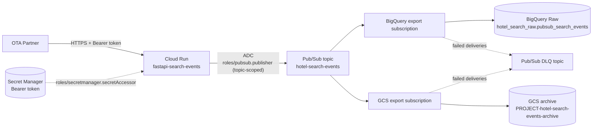

# fastapi-search-events-infra

Reference Terraform infrastructure for deploying the
[`fastapi-search-events`](../fastapi-search-events) study application to
Google Cloud. This is a **technical study/interview exercise**, not a
production infrastructure design -- see "Caveats" below for an honest list
of what's deliberately missing.

> ⚠️ No real GCP resources have been created while building this
> repository. No `terraform apply` was run. No secrets, real project IDs,
> or credentials are present anywhere in this repository.

## Objective

Demonstrate a single, understandable deployment path:

```text
Container image -> Cloud Run -> Pub/Sub -> BigQuery Raw + GCS Archive
```

Every resource in this repository exists to serve that one path, its
security, its traceability, or its recoverability. If a resource didn't
directly serve one of those, it was left out.

## Diagram



See [docs/architecture.md](docs/architecture.md) for the full diagram and
data-format details.

## Resources created

| Resource | Purpose | Identity that uses it | Data stored | Retention |
| --- | --- | --- | --- | --- |
| Artifact Registry repo (`bootstrap`) | Holds the FastAPI Docker image | Application CI (push), Cloud Run (pull) | Container image layers | Unbounded (manual cleanup) |
| GCS state bucket (`bootstrap`) | Terraform remote state for `environments/study` | Terraform (planner/deployer) | Terraform state (resource metadata, no application data) | Versioned, last 10 noncurrent versions |
| Cloud Run service | Runs the FastAPI ingestion API | Public (own Bearer auth) | None (stateless) | N/A |
| Runtime service account | Cloud Run's identity | Cloud Run only | N/A | N/A |
| Secret Manager secret | Holds the Bearer token | Cloud Run runtime SA (read only) | Bearer token (value added outside Terraform) | Until manually rotated/deleted |
| Pub/Sub topic | Main event stream | Cloud Run (publish), export subscriptions (read) | In-flight canonical events | 7 days message retention |
| Pub/Sub DLQ topic + subscription | Holds messages that failed delivery | Pub/Sub service agent (publish), operators (manual pull) | Failed canonical events | 7 days message retention |
| BigQuery dataset/table | Raw analytical landing zone | Pub/Sub service agent (write), future Silver layer (read) | Full canonical event JSON + delivery metadata | Unbounded (study default; revisit for production) |
| GCS archive bucket | Batched JSONL archive/replay | Pub/Sub service agent (write) | Full canonical event JSON, one per line | 30d Standard -> 90d Nearline -> 365d Coldline -> delete |

## Quick start (safe, local, non-destructive)

```bash
# From either bootstrap/ or environments/study/:
terraform fmt -check -recursive
terraform init -backend=false
terraform validate
```

TFLint and Checkov were **not available** in the environment used to build
this repository (`tflint`, `checkov` -- neither found on `PATH`). Their
configuration (`.tflint.hcl`, and Checkov invocation in
`cloudbuild/plan.yaml`) is included and ready to use, but their output is
**not** included in this README because it was never actually produced --
see "Validation results" below for what *was* actually run.

Steps that require real GCP credentials and were **not** performed:

```bash
# Requires real credentials + a real project:
terraform init -backend-config=backend.hcl   # environments/study only
terraform plan
terraform apply
```

## Repository layout

```text
fastapi-search-events-infra/
├── bootstrap/              # One-time: APIs, Artifact Registry, TF state bucket
├── environments/study/     # The actual workload: Pub/Sub, BigQuery, GCS, Cloud Run
├── cloudbuild/              # CI configs: plan (PRs) and apply (main only)
├── docs/                    # architecture, decisions, deployment, iam, monitoring, cost
├── .tflint.hcl
├── .gitignore
└── LICENSE
```

No `modules/` directory: every resource here has exactly one consumer
(`environments/study`), so a reusable module would add indirection without
benefit at this scale.

## Bootstrap sequence (summary)

1. Apply `bootstrap/` (APIs, Artifact Registry, Terraform state bucket) --
   uses local state, see [bootstrap/README.md](bootstrap/README.md).
2. Push the first application image; note its digest.
3. Add the real Bearer token value via `gcloud secrets versions add`
   (outside Terraform).
4. Set `container_image` (by digest) in `environments/study`.
5. Apply `environments/study/`.

Full detail in [docs/deployment.md](docs/deployment.md).

## Assumptions

- A single partner (`demo-ota`) and a single environment (`study`).
- Region `europe-west1` throughout.
- ~100 req/s average traffic, theoretical peaks of ~1,000 req/s.
- ~1 KiB average payload size.
- BigQuery Raw retention is left unbounded by default and flagged for
  review before any production use.
- The Bearer token is a deliberate simplification, not the final
  production auth mechanism (see `docs/decisions.md`).
- No load test has been run against this design.
- No Silver/Gold transformation layer exists yet; the BigQuery Raw table
  is the only analytical destination implemented here.

## Caveats

| Limitation | How it would be addressed in production |
| --- | --- |
| Cloud Run is publicly invokable at the platform level | Combine with Cloud Run IAM + OIDC, or move auth to API Gateway/Load Balancer + Cloud Armor (see `docs/decisions.md`) |
| Static Bearer token is not the final production auth | HMAC with replay protection, JWT from a real IdP, or OIDC federation |
| Archive contains the canonical event, not the original HTTP body byte-for-byte | Acceptable for this exercise; document explicitly if byte-level replay is ever required |
| No Pub/Sub topic schema | Add one if/when producers other than the validated FastAPI service appear |
| No deduplication in this infrastructure | Delegated to a future Silver layer using `partner_id` + `event_id` (see `docs/architecture.md`) |
| No Dataform / transformation layer | Out of scope; BigQuery Raw is the landing zone only |
| No end-to-end integration test performed | `terraform validate` only checks syntax/consistency, not real API behavior, permissions, or enabled services -- see `docs/deployment.md` |
| Managed Pub/Sub export subscription behavior not verified against a real project | Flagged explicitly in `environments/study/pubsub.tf`; validate in a sandbox project before relying on it |
| The secret's actual value lives outside Terraform | By design (see `secret_manager.tf`); document the `gcloud secrets versions add` step clearly (`docs/deployment.md`) |
| Full CI identity model (builder/planner/deployer SAs) not provisioned | Documented in `docs/iam.md`, deferred to avoid a bootstrap circularity for a single-partner study exercise |

## Validation results (what was actually run while building this repo)

See the end of this README's git history / conversation for the literal
command output. In summary:

- `terraform fmt -check -recursive`: formatting issues found and fixed.
- `terraform init -backend=false`: succeeded in both `bootstrap/` and
  `environments/study/`.
- `terraform validate`: succeeded in both roots after fixes.
- `tflint`: **not run** -- binary not installed in this environment.
- `checkov`: **not run** -- binary not installed in this environment.
- `terraform plan` / `terraform apply`: **not run** -- no real GCP
  credentials or project were used, per the exercise's own restrictions.

No claim is made that this infrastructure applies successfully against a
real project beyond what static validation above can confirm.
