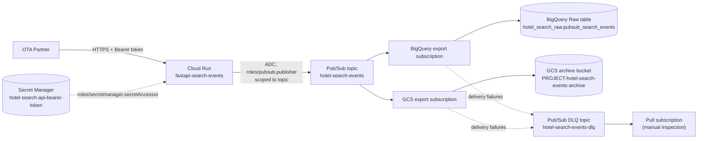
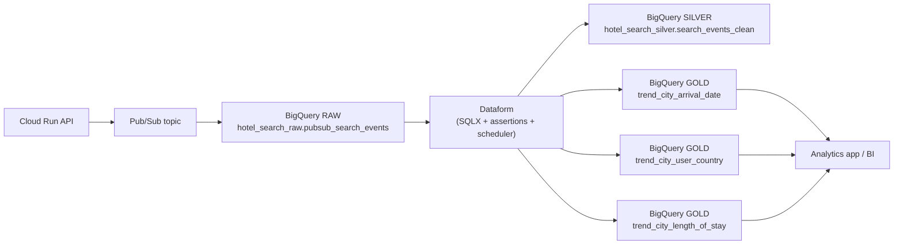

# Architecture

## Diagram



## What is implemented here vs. what is not

Implemented in this repository:

- Cloud Run service running the FastAPI container (built and pushed
  elsewhere, consumed here by digest).
- Pub/Sub topic + dead-letter topic + inspection subscription.
- BigQuery export subscription -> Raw dataset/table.
- Cloud Storage export subscription -> archive bucket.
- Secret Manager container for the Bearer token (value added outside
  Terraform).
- A dedicated, minimally-privileged Cloud Run runtime service account.
- Artifact Registry repository and Terraform remote state bucket
  (bootstrap stack).

Not implemented (out of scope for this study exercise; see root README
"Caveats" and `decisions.md`):

- Dataflow, Cloud Composer, GKE, Cloud SQL, Redis, Firestore.
- VPC Connector, Cloud NAT, API Gateway, external Load Balancer.
- Dataform / dbt / any Silver-Gold transformation layer.
- Multi-partner management, multi-region active-active.
- Cloud Run IAM-based auth, OIDC, HMAC, JWT (documented as production
  alternatives to the app's own Bearer token, not implemented).

## Data at rest

| Destination | Content | Format |
| --- | --- | --- |
| BigQuery Raw table | Full canonical event (`event_id`, `partner_id`, `schema_version`, `ingested_at`, `payload`) + Pub/Sub delivery metadata | One row per message, `data` column as BigQuery `JSON` type |
| GCS archive | Batched files of canonical events, one JSON object per line | JSONL (`.jsonl`), path prefixed by `partner=<partner_id>/`, then date/hour, per the Cloud Storage subscription's `filename_datetime_format` |

The archive contains the **canonical event as published by FastAPI**, not
necessarily the original raw HTTP request body byte-for-byte (headers like
`X-Event-Id` are folded into the canonical JSON's `event_id` field, for
example).

## Intended folder hierarchy in the archive bucket

```text
partner=demo-ota/
  ingestion_date=YYYY-MM-DD/
    hour=HH/
      <time>_<uuid>.jsonl
```

This layout is configured via `filename_prefix` and
`filename_datetime_format` on the `google_pubsub_subscription.gcs_export`
resource (see `environments/study/pubsub.tf`). Batching is controlled by
`max_duration` and `max_bytes` only -- the provider's
`cloud_storage_config` block has no `max_messages` attribute and no
`text_config` block; omitting `avro_config` is what selects plain-text
(one message per line) output, confirmed by `terraform validate` against
the installed `google` provider version while building this repository.
The exact tokens accepted by `filename_datetime_format` and the resulting
object keys have **not** been verified end-to-end against a real project
as part of this exercise; this is flagged explicitly as requiring
integration validation in a sandbox project before being relied upon.

## Target analytics extension (RAW -> Silver -> Gold with Dataform)

The current Terraform stack stops at the Raw landing zone by design.
For the interview/business case (city trends on arrival date, user country,
and length of stay), the intended extension is:



### Dataset strategy

- `hotel_search_raw`: immutable landing table populated by Pub/Sub export
  (already implemented).
- `hotel_search_silver`: cleaned, deduplicated, typed canonical events.
- `hotel_search_gold`: business-ready trend tables consumed by the
  application.

### Silver table (proposed)

`hotel_search_silver.search_events_clean`

Recommended columns:

- `event_id` STRING (dedup key)
- `partner_id` STRING
- `schema_version` STRING
- `ingested_at` TIMESTAMP
- `publish_time` TIMESTAMP
- `arrival_date` DATE
- `departure_date` DATE
- `length_of_stay` INT64
- `user_country` STRING
- `hotel_id` INT64
- `hotel_name` STRING
- `city` STRING
- `event_date` DATE (partition key, usually `arrival_date`)
- `is_valid_record` BOOL
- `dq_error_reason` STRING (nullable)

Silver transformations should include:

- JSON extraction/casting from Raw `data` into typed columns.
- Deduplication by `event_id` (latest `publish_time` wins).
- Country normalization to ISO-2 uppercase.
- Hard DQ filters for impossible/invalid values.

### Gold tables for the required trends

1. `hotel_search_gold.trend_city_arrival_date`
  - Grain: `city`, `arrival_date`, `metric_date`.
  - Metrics: `search_count`, `distinct_hotels`, `pct_share_city_day`.

2. `hotel_search_gold.trend_city_user_country`
  - Grain: `city`, `user_country`, `metric_date`.
  - Metrics: `search_count`, `unique_event_count`, `pct_share_city_country`.

3. `hotel_search_gold.trend_city_length_of_stay`
  - Grain: `city`, `length_of_stay`, `metric_date`.
  - Metrics: `search_count`, `avg_length_of_stay`, `pct_share_city_los_bucket`.

These three Gold tables directly support the required trend endpoints in
the consuming analytics application.

### Data validation approach

Validation is layered:

1. Ingestion/API layer (already implemented):
  Pydantic + header/auth checks reject malformed events before publish.
2. Raw-to-Silver layer (Dataform assertions):
  not-null checks, domain checks, duplicate checks, freshness checks.
3. Silver-to-Gold layer:
  reconciliation checks (Gold totals match Silver totals for each
  partition/day).

This keeps contract validation close to ingestion while still protecting
analytics quality at transformation time.

### Governance, privacy, performance, and error handling

- Data quality/governance:
  define owner and SLA per Gold table; fail Dataform workflow on critical
  assertion failures; track DQ results historically.
- Data privacy:
  avoid storing direct personal identifiers in Gold; apply column-level
  security or policy tags if sensitive fields are introduced later.
- Performance:
  incremental Silver/Gold builds by partition date; clustering by
  high-selectivity analytics dimensions (`city`, `arrival_date`).
- Error handling:
  keep DLQ operational playbook for ingestion failures, and add Dataform
  run alerts + retry policy for transformation failures.
