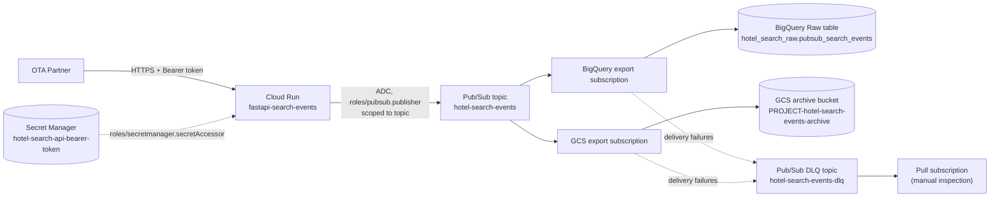

# Architecture

## Diagram



## What is implemented here vs. what is not

Implemented in this repository:

- Cloud Run service running the FastAPI container (built and pushed
  elsewhere, consumed here by digest).
- Pub/Sub topic + dead-letter topic + inspection subscription.
- BigQuery export subscription -> Raw dataset/table.
- Cloud Storage export subscription -> archive bucket.
- Secret Manager container for the Bearer token (value added outside
  Terraform).
- A dedicated, minimally-privileged Cloud Run runtime service account.
- Artifact Registry repository and Terraform remote state bucket
  (bootstrap stack).

Not implemented (out of scope for this study exercise; see root README
"Caveats" and `decisions.md`):

- Dataflow, Cloud Composer, GKE, Cloud SQL, Redis, Firestore.
- VPC Connector, Cloud NAT, API Gateway, external Load Balancer.
- Dataform / dbt / any Silver-Gold transformation layer.
- Multi-partner management, multi-region active-active.
- Cloud Run IAM-based auth, OIDC, HMAC, JWT (documented as production
  alternatives to the app's own Bearer token, not implemented).

## Data at rest

| Destination | Content | Format |
| --- | --- | --- |
| BigQuery Raw table | Full canonical event (`event_id`, `partner_id`, `schema_version`, `ingested_at`, `payload`) + Pub/Sub delivery metadata | One row per message, `data` column as BigQuery `JSON` type |
| GCS archive | Batched files of canonical events, one JSON object per line | JSONL (`.jsonl`), path prefixed by `partner=<partner_id>/`, then date/hour, per the Cloud Storage subscription's `filename_datetime_format` |

The archive contains the **canonical event as published by FastAPI**, not
necessarily the original raw HTTP request body byte-for-byte (headers like
`X-Event-Id` are folded into the canonical JSON's `event_id` field, for
example).

## Intended folder hierarchy in the archive bucket

```text
partner=demo-ota/
  ingestion_date=YYYY-MM-DD/
    hour=HH/
      <time>_<uuid>.jsonl
```

This layout is configured via `filename_prefix` and
`filename_datetime_format` on the `google_pubsub_subscription.gcs_export`
resource (see `environments/study/pubsub.tf`). Batching is controlled by
`max_duration` and `max_bytes` only -- the provider's
`cloud_storage_config` block has no `max_messages` attribute and no
`text_config` block; omitting `avro_config` is what selects plain-text
(one message per line) output, confirmed by `terraform validate` against
the installed `google` provider version while building this repository.
The exact tokens accepted by `filename_datetime_format` and the resulting
object keys have **not** been verified end-to-end against a real project
as part of this exercise; this is flagged explicitly as requiring
integration validation in a sandbox project before being relied upon.
